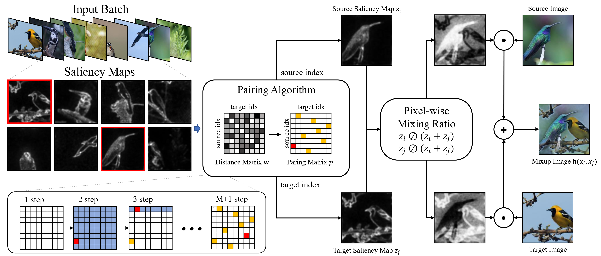

# GuidedMixup
Official PyTorch implementation of "GuidedMixup: An Efficient Mixup Strategy Guided by Saliency Maps" (AAAI'23, Oral) ([paper](https://arxiv.org/abs/2306.16612)) </br>



## Requirements

To install requirements:

```setup
pip install -r requirements.txt
```

Install pairing Algorithm:
```setup
python setup.py build_ext --inplace
```

## Training
-----
We provide the code for training the neural network above general classification datasets from [PuzzleMix](https://github.com/snu-mllab/PuzzleMix).

### Cifar-100

- To reproduce **Guided-SR with PreActResNet18 for 1200 epochs**, run:
```
python main.py --dataset cifar100 --data_dir [data_path] --root_dir [save_path] --labels_per_class 500 --arch preactresnet18  --learning_rate 0.1 --momentum 0.9 --decay 0.0001 --epochs 1200 --schedule 400 800 --gammas 0.1 0.1 --train mixup --guided True --condition greedy --mix_prob 0.5 --guided_type sr
```

- To reproduce **Guided-AP with PreActResNet18 for 1200 epochs**, run:
```
python main.py --dataset cifar100 --data_dir [data_path] --root_dir [save_path] --labels_per_class 500 --arch preactresnet18  --learning_rate 0.1 --momentum 0.9 --decay 0.0001 --epochs 1200 --schedule 400 800 --gammas 0.1 0.1 --train mixup --guided True --condition greedy --mix_prob 0.8 --guided_type ap
```

### Tiny-ImageNet
- To reproduce **Guided-SR with PreActResNet18 for 1200 epochs**, run:
```
python main.py --dataset tiny-imagenet-200 --data_dir [data_path] --root_dir [save_path] --labels_per_class 500 --arch preactresnet18  --learning_rate 0.2 --momentum 0.9 --decay 0.0001 --epochs 1200 --schedule 600 900 --gammas 0.1 0.1 --train mixup --guided True --condition greedy --mix_prob 0.5 --guided_type sr
```

- To reproduce **Guided-AP with PreActResNet18 for 1200 epochs**, run:
```
python main.py --dataset tiny-imagenet-200 --data_dir [data_path] --root_dir [save_path] --labels_per_class 500 --arch preactresnet18  --learning_rate 0.2 --momentum 0.9 --decay 0.0001 --epochs 1200 --schedule 600 900 --gammas 0.1 0.1 --train mixup --guided True --condition greedy --mix_prob 0.8 --guided_type ap --clean_lam 1.0
```


## Citing this Work and this Implementation
```
@inproceedings{kang2023guidedmixup,
  title={GuidedMixup: an efficient mixup strategy guided by saliency maps},
  author={Kang, Minsoo and Kim, Suhyun},
  booktitle={Proceedings of the AAAI Conference on Artificial Intelligence},
  volume={37},
  number={1},
  pages={1096--1104},
  year={2023}
}
```
